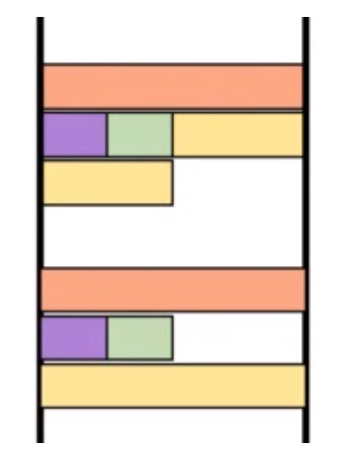

# PABE WS 2020/2021

## Practical Cheats

---

### Vulnerability Types

- Buffer Overflow (on stack and heap)
- Format String
- Use After Free
- ...

---
install stuff
```
sudo pacman -S gdb pwndbg python python-pwntools code git \
               ghidra nmap gcc lib32-gcc-libs lib32-glibc
```
---
use **PWNDBG**
```
echo 'source /usr/share/pwndbg/gdbinit.py' >> ~/.gdbinit
```
run with args `run foo bar`  
cond. breakpoints `break *<addr> if $rax == 0x3`  
watchpoints `watch/rwatch/awatch *<addr>` (write/read/access)  
step over and step into `ni / si`  
examine memory `x /<n><size><fmt> <addr>` (n=number; size=h,w,d,g; fmt=**S**tring, he**X**, **I**nstruction)  
altering registers `set $rip = <addr>`  
get maps with `vmmap`  
seach function with `p system`  
search string with `find <start_addr>, <end_addr>, "/bin/sh"`  
time traveling:
 - enable recording `target record-full` 
 - reverse continue `rc`
 - reverse step over `rni`
 - backwards execution `set exec-direction reverse`

---

Websites:

- godbolt.org Online C to Assembly
- http://shell-storm.org/online/Online-Assembler-and-Disassembler/ Assembler and Disassembler
- https://www.rapidtables.com/convert/number/hex-dec-bin-converter.html Converter

---

Strip symbols and sections: `strip a.out`  
Tracing: `ltrace` or `strace`  
Fiding bugs: `valgrind` or `-fsanitize-address`  
Finding strings in binary: `strings a.out`

---

Further Tools: 

- CVE-Checker FKIE
- Frida
- guyinatuxedo/remenissions
- tsunami
- Binary Ninja (to use API in Python)
---

## Theoretical Cheats
---
### Linux and System
---
| | | | |
:---:|:---:|:---:|:---:
Half Word | Word | Double Word | Quad Word
8bit | 16bit | 32bit | 64bit
char | short | int | long 

---
Stack alignment: 



---
Seccomp:  
- in `cat /proc/<id>/status`  
- determines the syscalls the process can invoke

---
### ELF Files


### Static Analysis (whiteboxing)

- parse the binary directly
- semantic gap
- we need dataflow analysis to track variables

Symbolic execution:


---

Dissassembly:

- **Linear Sweep:** disassemble a stream of bytes into successive instructions
- **Recursive Traversal:** follow the control flow to disassemble

---

#### Calling Conventions

| name | arch | parametres | return | cleanup | perserves |
|:---: |:---: |:---:       |:---:   |:---:    |:---:      |
| **cdecl** | x86 gcc | push p_n ... push p_1 | eax | caller |all but eax, ecx, edx|
| **AMD64 ABI** | x64 gcc | rdi, rsi, rdx, rcx, r8, r9| rax | caller | all but eax, ecx, edx|
| **fastcall** | x86 Win | who | the | fuck | cares | 
| **MS x64 CC** | x64 Win | who | the | fuck | cares |

---

### Dynamic Analysis (blackboxing)

- fuzzing
- sandbox
- emulation
- debugging

---

### Vuln Research

> Bug != Vulnerability != Exploit

Target CIA: 
- Confidentiallity
- Integrity
- Availability

Scoping: choosing elements to analyse instead of the whole thing

Attack Surfaces:
- Arguments
- stdin
- env vars
- files
- network sockets
- signals / exceptions

C Language Issues:
- Unerflows/Overflows
- Truncations
- Stack Overflows
- Heap Overflows
- Out of Scope
- Out of Bounds
- Double Free
- Memory Leaks

> TODO: C TYPE PROMOTION??? 

### ASAN


### Fuzzing


### CVE vs CWE

- Common Vulnerabilities and Exposures: a weakness in a program

- Common Weakness Enumeration: an abstract list of types of weaknesses

### Dataflow analysis

Backwardslice: Trace a value to its origin.

### Intermediate Representation

- vex:

- reil: 

- llvm:

- esil: stack based represenation (used in radare)

- bil: 

- bnil: binary ninja intermediate language

- SSA: every variable only gets defined and assigned ONCE. When overwritten, SSA creates a new variable.

- SSA+PHI: if a variable depends on multiple others dependent on flow | `var_8#2 := PHI(var_8#0, var_8#1)`

- Taint Analysis: check where the variables 'come from', i.e. if `var_8#3` maybe was already checked as `var_8#2`

- Dominance Tree: A dominates B if every path to B stems from A

- Z3 to see if logic checks out

- value set analysis: not all input params produce the same flow. We can check if different possible paths are feasible or break logic, to reduce the amount of paths.

- can only have **two**

    - Termination
    - Soundness (all facts)
    - Completeness (only facts)

